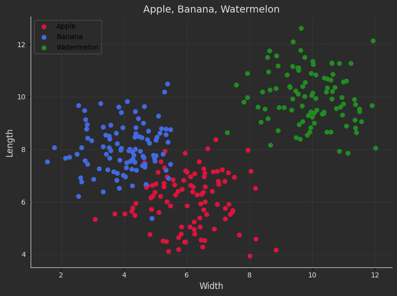
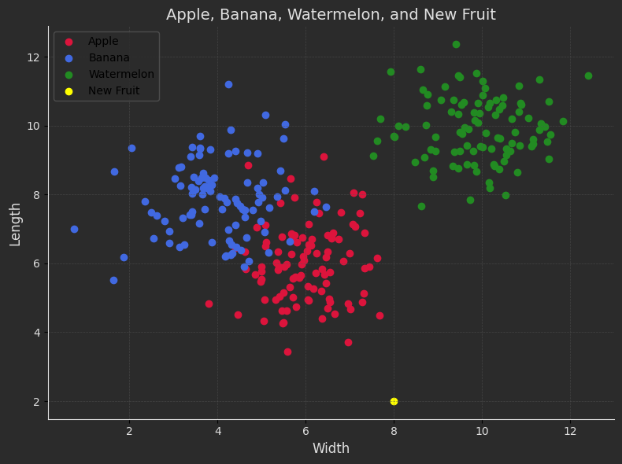

# k-Nearest Neighbors (kNN) Algorithm Implementation

This repository contains an implementation of the **k-Nearest Neighbors (kNN)** algorithm for classification. The algorithm is designed to classify data into one of three categories: 🍎 **Apple**, 🍌 **Banana**, and 🍉 **Watermelon**. The repository demonstrates how kNN can be used for multi-class classification with a simple dataset.

---

## Features
- **k-Nearest Neighbors Algorithm**: Implementation of kNN for a 3-class classification problem.
- **Visualization**: Scatter plots of the data and decision boundaries.
- **Customizable Parameters**: Adjust the value of **k**, distance metrics, and dataset properties.

  

---

## How It Works

1. **Dataset Creation**:

- Generates sample data points for the three classes: 🍎, 🍌, and 🍉.
- Each class is represented by clusters in a 2D feature space (e.g., width and length).

2. **kNN Algorithm**:

- Computes the distance between a given point and all other data points.
- Identifies the k nearest neighbors based on the distance.
- Assigns the class label based on majority voting.

3. **Visualization**:

- Scatter plots to display the data points for each class.
- Displays the predicted class of new data points.

    


---

## How to Run the Code
1. Clone the repository:
   ```sh
   https://github.com/nakhani/Data-Science/tree/cbe1628d2d9166f5e18caaafd4db6969aac1dc87/Data%20Science_2
   ```

2. Navigate to the directory:
   ```sh
   KNN
   ```

3. Install the required packages:
   ```sh
   pip install -r requirements.txt
   ```

4. Run the assignments:

   ```sh
    jupyter notebook fruit_calssification.ipynb # For running KNN algorithm for 3 categories
   ```

## Dependencies
- Python 3.8+
- Libraries:
  - NumPy
  - Matplotlib