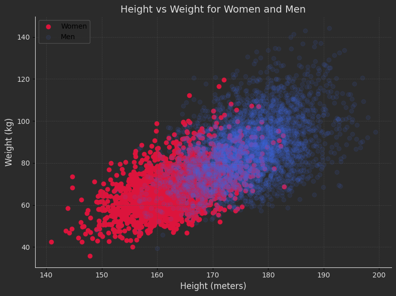
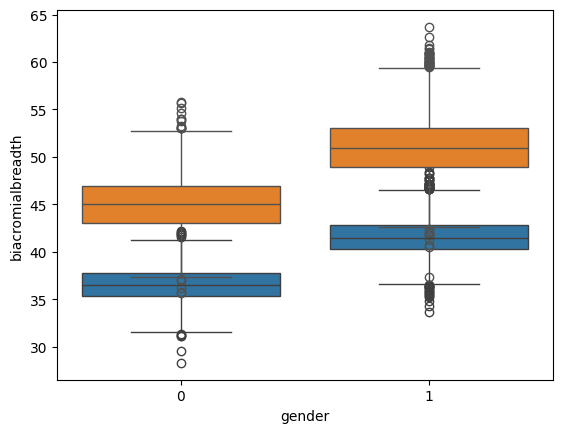
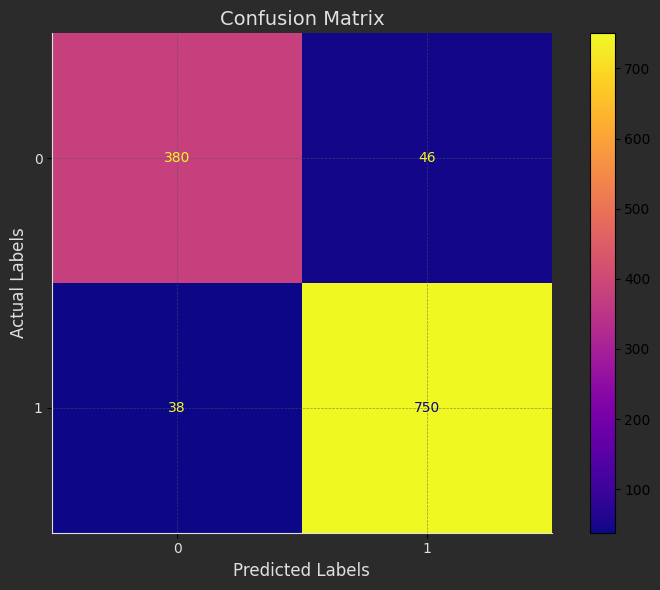

# k-Nearest Neighbors (kNN) Algorithm Implementation

This repository implements a k-Nearest Neighbors (KNN) algorithm, applied to the **ANSUR II dataset** for gender classification based on anthropometric measurements.

---

## Dataset
The dataset is sourced from:
- [Kaggle](https://www.kaggle.com/)
- [OpenLab Website - ANSUR II | The OPEN Design Lab](https://www.openlab.org)

---

### **Preprocessing:**
1. Convert units for **weight** , **height** , **biacromialbreadth** and **bideltoidbreadth** into consistent measurements.
2. Ensure the `gender` column datatype is properly encoded for classification.
3. Concatenate male and female datasets into one unified dataset.
4. Standardize column names by:
    - Converting to lowercase.
    - Stripping extra whitespace.
    - Replacing spaces with underscores.

---

## Visualizations

### **Height Distribution Plot**
1. **Goal**: Show heights for both **women** and **men** on the same plot.

   

2. **Insights**:
   - **Q1**: Why is the data for men higher than the data for women?
      - Answer: Men typically have a greater average height, as observed in biological and anthropometric trends.
   - **Q2**: Why is the data for men more shifted to the right compared to women?
      - Answer: The height distribution of men exhibits a wider range and higher values overall, creating the shift.


---

## Feature Selection

To ensure high model accuracy, feature selection is performed using statistical and visual analysis methods:

1. **Correlation Analysis**:
   - Compute the correlation coefficients between `gender` and features like `biacromialbreadth` and `bideltoidbreadth`:

      | **Feature**         | **Correlation with Gender**  |
      |----------------------|-----------------------------|
      | Gender              | 1.0                          |
      | Biacromialbreadth   | 0.78                         |
      | Bideltoidbreadth    | 0.66                         |

    
   - Insights:
     - Features with higher correlation values with `gender` are strong candidates for classification.

2. **Boxplot Visualization**:
   - Use boxplots to explore the distribution of `biacromialbreadth` and `bideltoidbreadth` across genders:

      

   - Insights:
     - Boxplots help visualize group differences and variations between `men` and `women`.

3. **T-Test for Statistical Significance**:
   - Conduct independent t-tests to compare feature values for males and females:
      
      | **Feature**           | **T-Statistic**         | **P-Value** |
      |------------------------|------------------------|-------------|
      | Biacromialbreadth      | 97.4                   | 0.0         |
      | Bideltoidbreadth       | 70.1                   | 0.0         |

     
   - Insights:
     - A small p-value (typically < 0.05) indicates that the differences between males and females for the given feature are statistically significant.

4. **Variance Analysis**:
   - Analyze the variability of `biacromialbreadth` and `bideltoidbreadth` to ensure they provide enough spread for classification:

      | **Feature**           | **Variance**        |
      |------------------------|--------------------|
      | Biacromialbreadth      | 9.14               |
      | Bideltoidbreadth       | 17.75              |


5. **Mean Comparison by Gender**:
   - Compute group means for selected features to observe distinct patterns:

      | **Gender**           | **Biacromial Breadth (Mean)** | **Bideltoid Breadth (Mean)** |
      |-----------------------|------------------------------|------------------------------|
      | Women (0)            | 36.534894                   | 45.032427                   |
      | Men (1)              | 41.567565                   | 51.042479                   |

     
   - Insights:
     - Mean differences further validate the suitability of the features for classification.

6. **Scatter Plot: Biacromial Breadth vs. Bideltoid Breadth**

   - Visualize the relationship between **Biacromial Breadth** and **Bideltoid Breadth** for both **women** and **men**.

      

   - Insights
         - The data shows clear clusters for women and men based on these two features.
         - Men tend to have higher values for both **Biacromial Breadth** and **Bideltoid Breadth**, as expected due to physiological differences.
---
### Importance
These methods collectively help in selecting the most relevant features (**biacromialbreadth** and **bideltoidbreadth**) for the KNN model, improving its accuracy by focusing on statistically significant and visually distinct variables.

---

## Model Implementation

### **Dataset Split**:
The dataset is divided into training and testing subsets:
- **Training Data**: 80%
- **Testing Data**: 20%

---

# Custom KNN Algorithm

### Implementation
A custom, object-oriented KNN algorithm was implemented. The model was trained on the training dataset and evaluated on the testing dataset.

### **Accuracy Results**
Accuracy for different values of `k`:

  | k Value | Accuracy |
  |---------|----------|
  | 3       | 92.34%   |
  | 5       | 93.08%   |
  | 7       | 93.00%   |

### **Confusion Matrix (Custom KNN)**
Generated for the test dataset:

  

---

# Scikit-Learn KNN Implementation

### Implementation
The Scikit-Learn KNN algorithm was used to benchmark the custom implementation.

### **Accuracy Results**
Accuracy for different values of `k`:

  | k Value | Accuracy |
  |---------|----------|
  | 3       | 92.34%   |
  | 5       | 93.08%   |
  | 7       | 93.00%   |

### **Confusion Matrix (Custom KNN)**
Generated for the test dataset:

  


## Conclusion
Both the **custom** and **Scikit-Learn KNN algorithms** produce comparable results, with high accuracy and consistency in predictions for gender classification.

---
## How to Run the Code
1. Clone the repository:
   ```sh
   https://github.com/nakhani/Machine-Learning-/tree/5240ac51e8a47ce4d74aa57e7128754ebd5017b0/KNN_2  
   ```

2. Navigate to the directory:
   ```sh
   KNN_2
   ```

3. Install the required packages:
   ```sh
   pip install -r requirements.txt
   ```

4. Run the assignments:

   ```sh
    jupyter notebook ansur_2.ipynb # For training ANSUR II dataset with KNN 
   ```

## Dependencies
- Python 3.8+
- Libraries:
  - NumPy
  - Matplotlib
  - Pandas 
  - Scikit_learn
  - Seaborn
  - SciPy