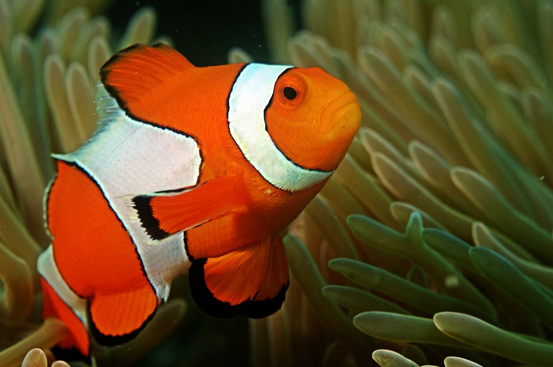

# KNN-Based Image Processing and Classification

This repository demonstrates the use of the k-Nearest Neighbors (KNN) algorithm for various applications, including **image processing** with Nemo and Dory, and **dataset classification** with IRIS and Breast Cancer datasets.

---

## **Finding Nemo**
This project focuses on removing the background and detecting Nemo in images using HSV color space and KNN.

### **Steps:**
1. Implemented the `KNN` class for classification.
2. Created a training dataset by labeling Nemo pixels (🟠orange, ⚪white, ⚫black) and background pixels.
3. Trained the KNN classifier with the labeled dataset.
4. Predicted Nemo pixels in new test images and removed the background.
5. Encapsulated all steps in the `FindingNemo` class for automation.

### **Technologies Used:** 
Python (OpenCV, NumPy, Matplotlib)

### **Result:**

**Training Image**:

   

   

**Test Image**:

   

   

---

## **Finding Dory**
Building on the Nemo project, this section extends the algorithm for detecting Dory. The HSV color space and KNN classifier are adapted for Dory's unique color scheme.

### **Steps:**
1. Labeled pixels for Dory’s colors (e.g., 🔵blue and 🟡yellow) and background pixels.
2. Trained the KNN classifier on Dory-specific data.
3. Predicted and segmented Dory pixels in new test images.

### **Result:**

**Training Image**:

  

  

**Test Image**:

  

  


### **Confusion Matrix (2x2):**
   


---

## **IRIS Dataset**
The IRIS dataset is used to classify different species of iris flowers (Setosa, Versicolor, Virginica) based on features such as sepal and petal dimensions.

### **Steps:**
1. Loaded the IRIS dataset using Scikit-learn.
2. Split the dataset into training (80%) and testing (20%).
3. Implemented and trained the `KNN` algorithm.
4. Evaluated with different values of `k` (e.g., 3, 5, 7) and calculated accuracy and confusion matrix.

### **Accuracy Results:**

   | **k Value** | **Accuracy (%)** |
   |-------------|------------------|
   | 3           | 100.0            |
   | 5           | 100.0            |
   | 7           | 96.6             |

### **Confusion Matrix (3x3):**

   

---

## **Breast Cancer Dataset**
The Breast Cancer dataset is used to classify patients based on diagnostic data (e.g., malignant or benign).

### **Steps:**
1. Loaded the Breast Cancer dataset using Scikit-learn.
2. Split the dataset into training (80%) and testing (20%).
3. Implemented and trained the `KNN` algorithm.
4. Evaluated with different values of `k` (e.g., 3, 5, 7) and calculated accuracy and confusion matrix.

### **Accuracy Results:**

   | **k Value** | **Accuracy (%)** |
   |-------------|------------------|
   | 3           | 93.8             |
   | 5           | 92.9             |
   | 7           | 95.6             |


### **Confusion Matrix (2x2):**

   


---
## How to Run the Code
1. Clone the repository:
   ```sh
   https://github.com/nakhani/Machine-Learning-/tree/a63f2be10c127a5b6d240f6a736bd972c9badbc7/KNN_3
   ```

2. Navigate to the directory:
   ```sh
   KNN_3
   ```

3. Install the required packages:
   ```sh
   pip install -r requirements.txt
   ```

4. Run the assignments:

   ```sh
    jupyter notebook cancer.ipynb # For classify Breast Cancer dataset with KNN 
    jupyter notebook Iris.ipynb # For classify  Iris dataset with KNN 
    jupyter notebook nemo.ipynb # For detecting and removing background of Nemo's image with KNN 
    jupyter notebook dory.ipynb # For detecting and removing background of Dory's image with KNN 
   ```

## Dependencies
- Python (OpenCV, NumPy, Matplotlib, Scikit-learn)
- Jupyter Notebook
- Confusion Matrices (Generated using Scikit-learn)