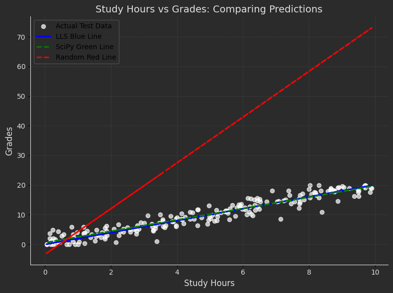
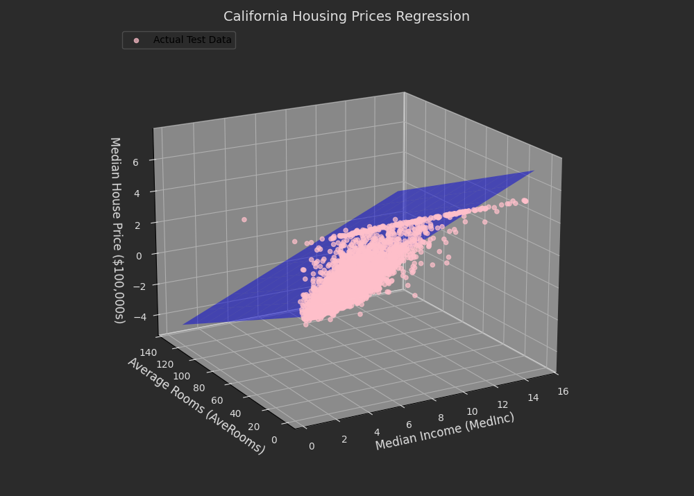
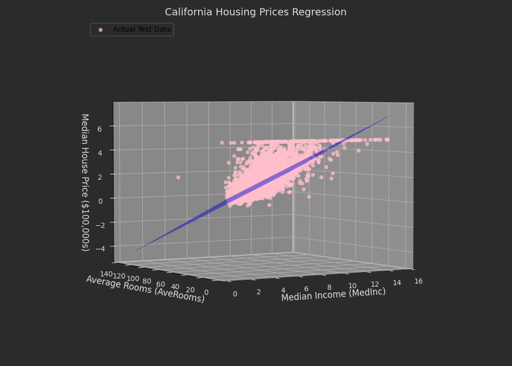
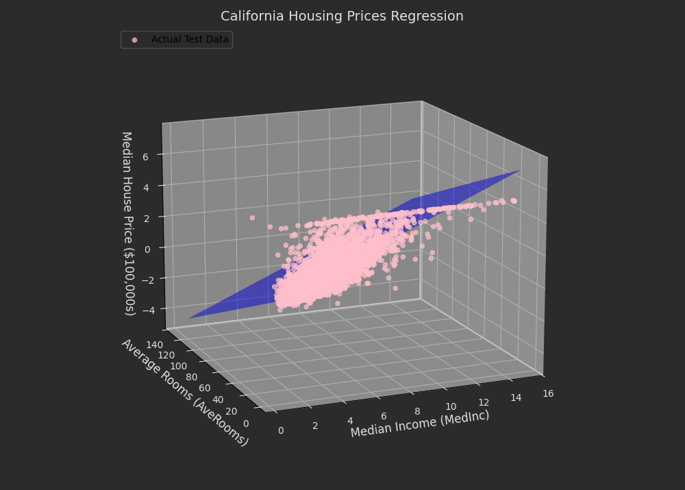

# Linear Least Squares (LLS) Regression

This repository demonstrates two linear regression projects using the **Linear Least Squares (LLS)** method. Both projects showcase the relationship between input features and target values, and provide analysis and visualization of results using regression techniques.

---

## **Students Performance (Regression)**
Predict student grades based on the number of study hours, illustrating how studying more correlates with better grades.

#### Implementation:
- **Dataset**: A randomly generated dataset where:
  - `X = study hours`
  - `Y = grades` (with some noise added).
- **Steps**:
  - Split the dataset into training and testing sets using `train_test_split`.
  - Visualize incorrect regression attempts (random red lines).
  - Fit an **LLS model** to predict grades (correct regression line in blue).
  - Compare results with `scipy`'s `linregress` regression (green line).

### **Result:**

   

### Performance Metrics

  | **Metric**                         | **Students Performance** | 
  |------------------------------------|--------------------------|
  | **Mean Absolute Error (MAE)**      | 1.37                     | 
  | **Mean Squared Error (MSE)**       | 3.20                     | 
  | **Root Mean Squared Error (RMSE)** | 1.79                     | 
  | **R-squared (R²)**                 | 0.90                     | 

---

## **California House-Prices (Regression)**
Predict housing prices using selected features from the California dataset, showcasing the relationship between features and house prices.

#### Implementation:
- **Dataset**: California house prices dataset from `scikit-learn`.
  - Features:
    - `X = AveRooms` and `MedInc`.
  - Target:
    - `Y = Median House Prices (MEDV)`.
- **Steps**:
  - Split the dataset into training and testing sets using `train_test_split`.
  - Fit an **LLS model** to predict house prices.
  - Visualize results in a **3D plot**, including:
    - Actual test data (Pink points).
    - Regression plane based on `y_pred` (blue plane).

### **Result:**

  

  

  


### Performance Metrics

  | **Metric**                         | **California House-Prices** | 
  |------------------------------------|-----------------------------|
  | **Mean Absolute Error (MAE)**      | 0.62                        | 
  | **Mean Squared Error (MSE)**       | 0.70                        | 
  | **Root Mean Squared Error (RMSE)** | 0.83                        | 
  | **R-squared (R²)**                 | 0.46                        | 


---

## How to Run the Code
1. Clone the repository:
   ```sh
   https://github.com/nakhani/Machine-Learning-/tree/97f4905c47ff9b6bccbafcc0c221ed7167ffea48/LLS
   ```

2. Navigate to the directory:
   ```sh
   LLS
   ```

3. Install the required packages:
   ```sh
   pip install -r requirements.txt
   ```

4. Run the assignments:

   ```sh
    jupyter notebook california_predict.ipynb # For predict california house prices with LLS 
    jupyter notebook student_grade_predict.ipynb # For predict student's grade with LLS 
   ```

## Dependencies
- Python (OpenCV, NumPy, Matplotlib, Scikit-learn)
- Jupyter Notebook
- Confusion Matrices (Generated using Scikit-learn)