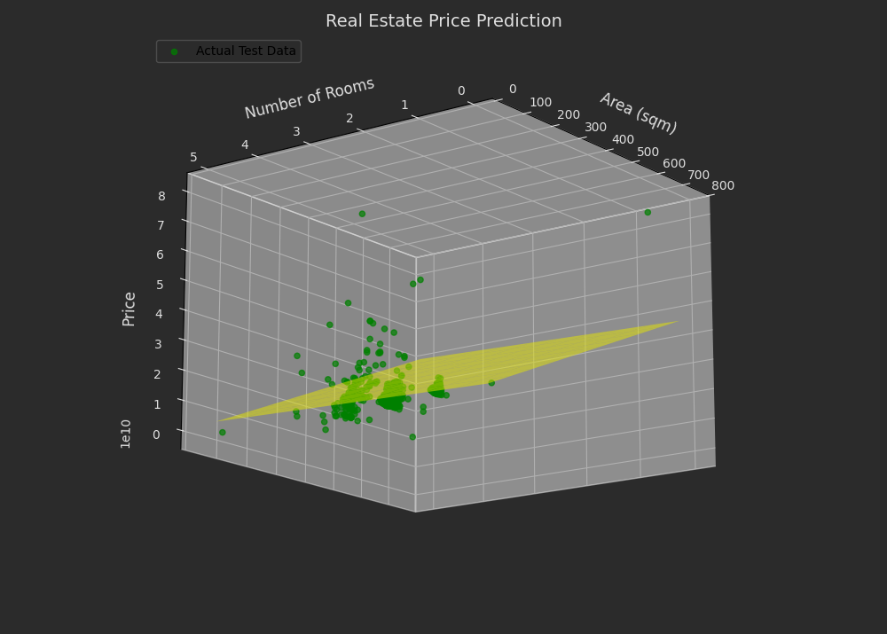
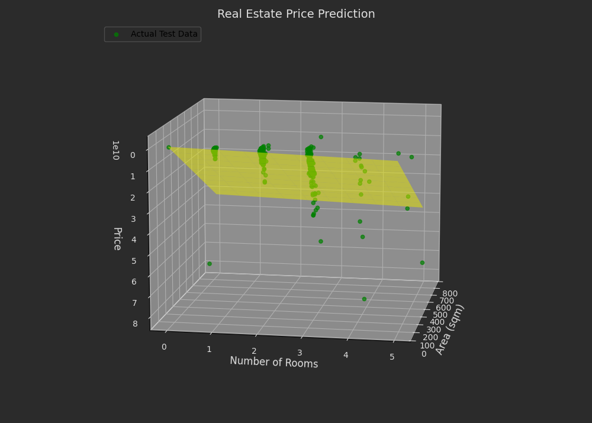
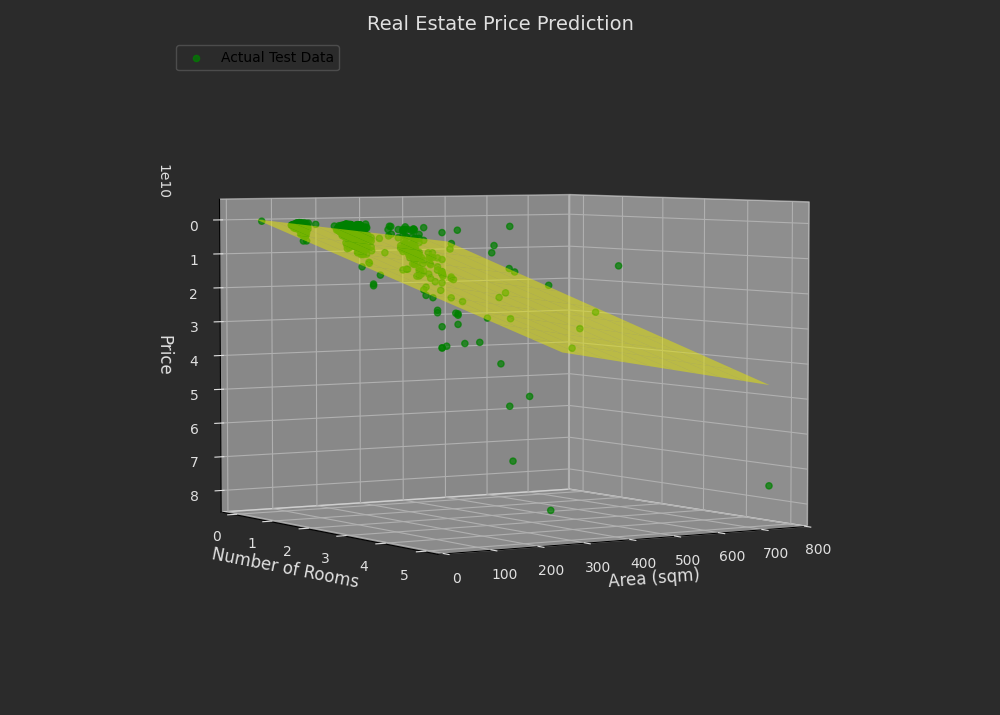

# Linear Least Squares (LLS) Regression

This repository demonstrates two linear regression projects using the **Linear Least Squares (LLS)** method. Both projects explore the relationship between input features and target values, showcasing preprocessing techniques, model evaluation, and comparisons with 

---

## **Tehran House Price Prediction**
Predict house prices in Tehran using all available features, along with preprocessing techniques to update dollar prices to July 2023.

### **Implementation**:
- **Dataset**: Housing data from Tehran (Divar.ir).
  - **Features**:
    - `X = Area`, `Room`, `Parking`, `Warehouse`, `Elevator`, and additional location-based features.
  - **Target**:
    - `Y = House Price`.
- **Steps**:
  - **Preprocessing**: Update dollar prices to July 2023, clean and format the dataset for analysis.
  - **Feature Selection**: Use all possible features for training (`X_train`).
  - **Split Dataset**: Implement `train_test_split` function from scratch to divide data into training and testing sets.
  - **Fit Model**: Train the LLS model using the training data.
  - **Evaluate**: Use **MAE**, **MSE**, and **RMSE** to measure performance on the test set.
  - **Comparison**: Compare results with Scikit-Learn’s `LinearRegression` and `RidgeCV`.

### **Result:**

  

  

  

### Performance Metrics

   | **Metric**                         | **LLS Model Result**             | **Scikit-Learn: LinearRegression** | **Scikit-Learn: RidgeCV**         |
   |------------------------------------|-----------------------------------|-------------------------------------|-----------------------------------|
   | **Mean Absolute Error (MAE)**      | 2015576756                         | 2015418643                           | 1999349713                        |
   | **Mean Squared Error (MSE)**       | 2.01                          | 2.01                           | 1.85                         |
   | **Root Mean Squared Error (RMSE)** | 4490142081                         | 4490059821                            | 4306790504                         |
   | **R-squared (R²)**                 | 0.56                              | 0.69                                | 0.72                             |


---

## **Dollar Rial Price**
Analyze dollar price variations under three Iranian presidencies: Ahmadinejad, Rouhani, and Raisi.

### **Implementation**:
- **Dataset**: Historical dollar-to-rial exchange rates.
  - **Features**:
    - `X = Presidency`, `Date_numeric`, `Open`, `High`, and `Low`.
  - **Target**:
    - `Y = Dollar Price`.
- **Steps**:
  - **Divide Dataset**: Split the dataset into subsets corresponding to each presidency.
  - **Analysis**:
    - Show the highest and lowest dollar prices during each presidency.
  - **Split Dataset**: Divide each subset into training and testing sets using a custom `train_test_split` function.
  - **Fit Model**: Train the LLS model for each presidency subset.
  - **Evaluate**: Measure performance using **MAE** and compare results across presidencies using Scikit-Learn’s `mean_absolute_error`.


### **Result:**

### **Dollar Price Analysis**

| **Presidency**          | **Highest Dollar Price** | **Lowest Dollar Price** |
|-------------------------|--------------------------|-------------------------|
| **Ahmadinejad**         | 3,890                    | 1,335                   |
| **Rouhani**             | 31,800                   | 2,800                   |
| **Raisi**               | 55,000                   | 20,600                  |


### Performance Metrics
 
| **Metric**                         | **LLS Model Result**             | **Scikit-Learn: LinearRegression** |
|------------------------------------|-----------------------------------|-------------------------------------|
| **Mean Absolute Error (MAE)**      | 567                       | 567                          |
| **Mean Squared Error (MSE)**       | 14031645                                | 14031645                                 |
| **Root Mean Squared Error (RMSE)** | 3745                         | 3745                          |
| **R-squared (R²)**                 | 0.99                              | 0.99                                 |


---

## How to Run the Code
1. Clone the repository:
   ```sh
   https://github.com/nakhani/Machine-Learning-/tree/97f4905c47ff9b6bccbafcc0c221ed7167ffea48/LLS
   ```

2. Navigate to the directory:
   ```sh
   LLS_2
   ```

3. Install the required packages:
   ```sh
   pip install -r requirements.txt
   ```

4. Run the assignments:

   ```sh
    jupyter notebook house_price.ipynb # For predict house prices in Tehran with LLS 
    jupyter notebook dollar_rial.ipynb # For predict DOllar in several years with LLS 
   ```

## Dependencies
- Python (Pandas, NumPy, Matplotlib, SciPy, Scikit-learn)
- Jupyter Notebook
- Performance Metrics (Generated using Scikit-learn)