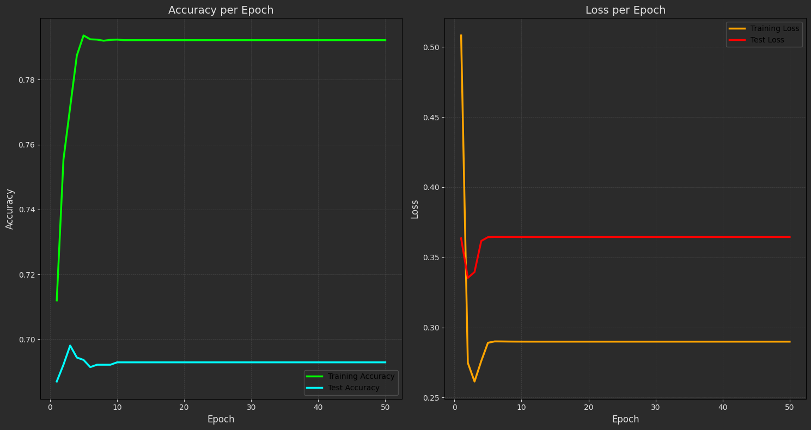
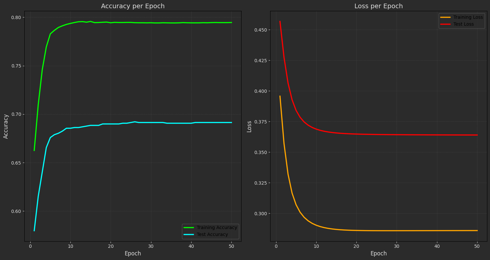
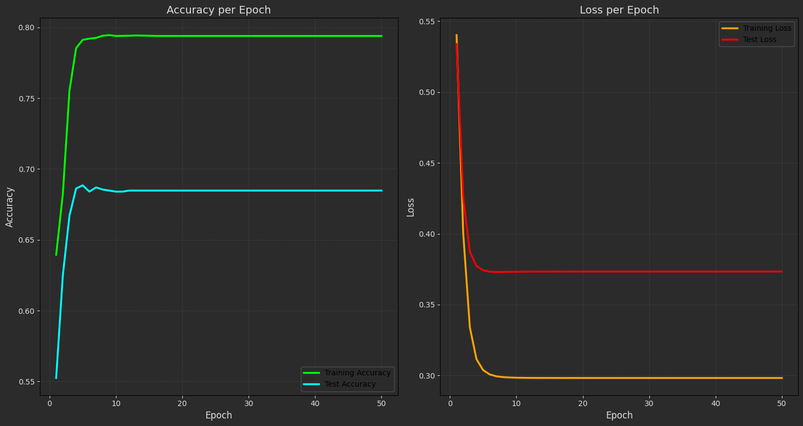
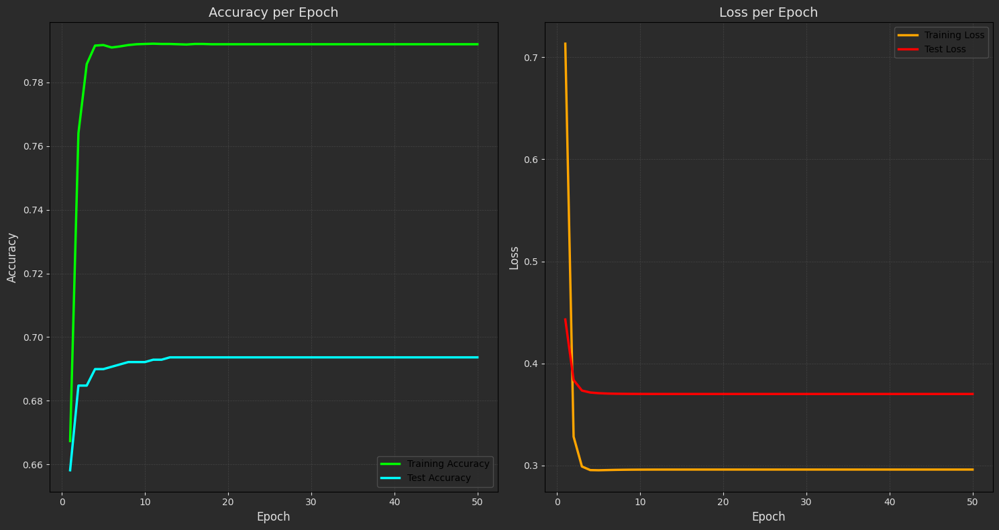
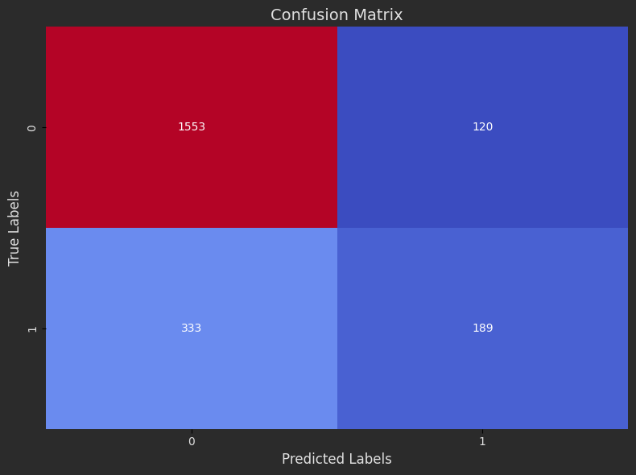
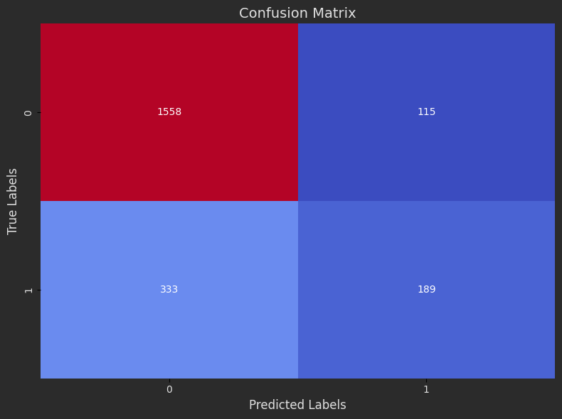
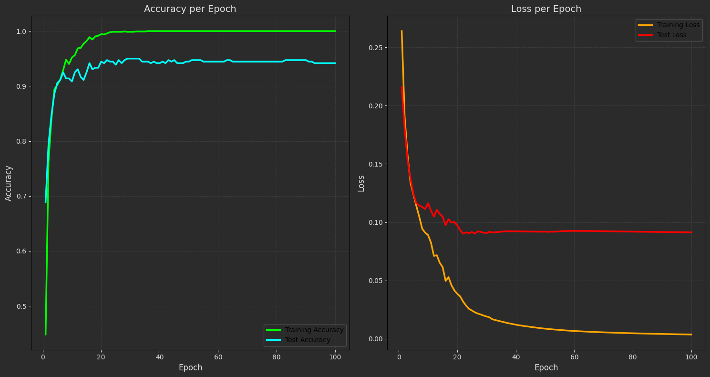
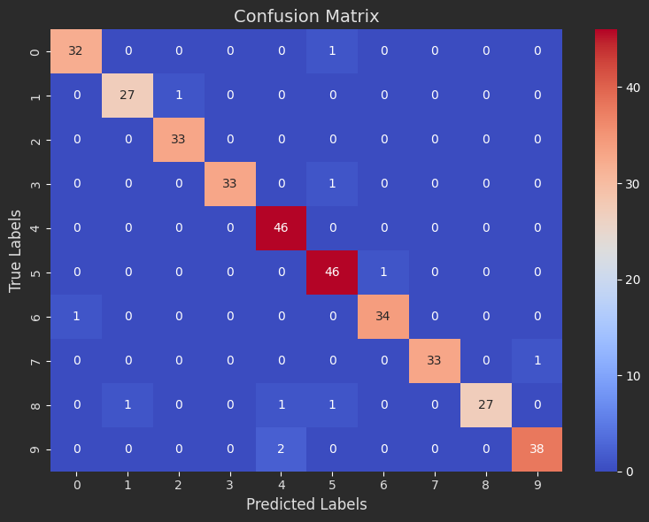

# Multi Layer Perceptron (MLP)

This repository showcases the implementation of Multi-Layer Perceptron (MLP) applied to both classification and regression tasks. The MLP is implemented as an object-oriented neural network and is used to explore non-linear models in various datasets, including digit recognition and surgical prediction problems.

---
## Projects

### **1. Surgical Dataset 🏨**
A binary classification task using the perceptron algorithm. 

- **Key Steps**:
  - Train an object-oriented perceptron on the surgical dataset for binary classification.
  - Plot the **accuracy** and **loss** for both training and testing data at each epoch.
  - Calculate and visualize the confusion matrix, precision and recall.
  - Experiment with 5 different activation functions: `sigmoid`, `tanh`, `relu`, `linear`.

---

### **2. Scikit-Learn Digits Dataset 🖼️**
A classification task aimed at recognizing handwritten digits from the Scikit-Learn `digits` dataset.

#### Key Steps:

- Train an object-oriented neural network (MLP) on the dataset.
- Implement essential neural network methods: `fit`, `evaluate`, `predict`.
- Create `OneHotEncoder` and `OneHotDecoder` functions from scratch and compare their functionality with Scikit-Learn's `OneHotEncoder`.
- Test the `predict` method using images of digits written in your own handwriting.

#### Visualization:
- Plot training and testing **loss** and **accuracy** for each epoch using Matplotlib.
- Generate and visualize the confusion matrix.

---

## Features

### **Custom MLP Implementation**
- Object-oriented structure for modularity and flexibility.
- Supports essential methods:
  - **fit**: Train the MLP on the digits dataset.
  - **evaluate**: Compute loss and accuracy for the dataset.
  - **predict**: Predict digit labels for new images.
- Implemented from scratch:
  - **OneHotEncoder**: Converts categorical labels to one-hot encoded format.
  - **OneHotDecoder**: Decodes one-hot encoded labels back to categorical format.

### **Data Visualization**
- Plot loss and accuracy for both training and testing phases.
- Confusion matrix visualization to evaluate classification performance.

### **Image Testing**
- Test the `predict` method with images of handwritten digits. The images must be preprocessed to match the input shape of the MLP.

---

### **Result:**

#### **1.Surgical Dataset 🏨**

- Loss and Accuracy Plots:

 - Relu:

    

 - Sigmiod:
    
    

 - Tanh:
   
    

 - Linear:
   
    


- Confusion Matrix:

 - Relu:

    

 - Sigmiod:
    
    

 - Tanh:
   
    

 - Linear:
   
    

  

- Evaluated Table:

  | Activation Functions | Test Loss | Test Accuracy| Custom Precision | Custom Recall | Scikit-Learn Precision | Scikit-Learn Recall |
  |----------------------|-----------|--------------|--------------|--------------|--------------|--------------|
  | Relu                 | 0.37      | 0.68         | 0.61 | 0.36 | 0.61 | 0.36 |
  | Sigmoid              | 0.37      | 0.68         | 0.62 | 0.36 | 0.62 | 0.36 |
  | Tanh                 | 0.38      | 0.68         | 0.59 | 0.38 | 0.59 | 0.38 |
  | Linear               | 0.37      | 0.68         | 0.60 | 0.35 | 0.60 | 0.35 |
 


#### **2.Scikit-Learn Digits Dataset**


- Training and testing loss over epochs:

  


- Confusion Matrix:

  

- Evaluate Table:

   | Loss Train | Accuracy Train | Loss Test | Accuracy Test |
   |------------|----------------|-----------|---------------|
   | 0.01       | 1.00           |  0.05     |  0.98         |

---
## How to Run the Code
1. Clone the repository:
   ```sh
   https://github.com/nakhani/Machine-Learning/tree/8dd577774a957e3e7556c3d0fae07b0689ffa3be/MLP
   ```

2. Navigate to the directory:
   ```sh
   MLP
   ```

3. Install the required packages:
   ```sh
   pip install -r requirements.txt
   ```

4. Run the assignments:

   ```sh
    jupyter notebook surgical.ipynb # For predict wether a person has a disorder sign with perceptron 
    jupyter notebook digit_predict_Oriented.ipynb # For predict the hand writing digit with mlp
   ```

## Dependencies
- Python (OpenCv, Pandas, NumPy, Matplotlib, Scikit-learn)
- Jupyter Notebook
