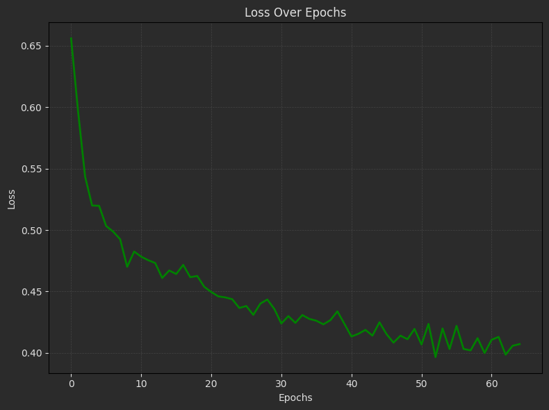
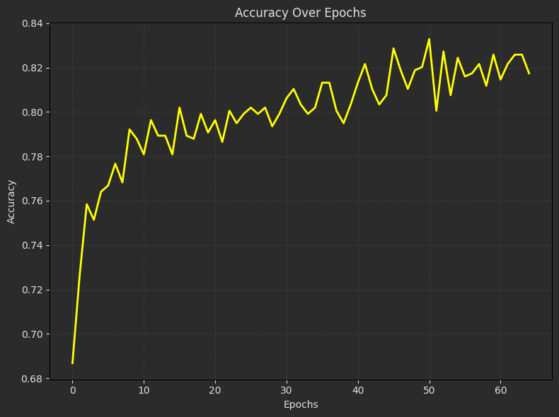

# MLP Using TensorFlow
This project aims to build a predictive model that answers the question: **what sorts of people were more likely to survive the Titanic disaster?**

We implement a **Multilayer Perceptron (MLP)** neural network using TensorFlow for classification. The dataset consists of Titanic passenger information, and the objective is to predict survival outcomes (`Survived`).

---

## Steps

1. **Data Preparation:**
   - Load the training and testing datasets (`train.csv` and `test.csv`).
   - Clean and preprocess the data:
     - Replace gender (`female`, `male`) with numerical values.
     - Fill missing values.
     - Scale the input features using `StandardScaler`.

2. **Model Development:**
   - Implement three algorithms for classification:
     - **K-Nearest Neighbors (KNN)** using `sklearn`.
     - **Perceptron** as a simple single-layer neural network in TensorFlow.
     - **Multilayer Perceptron (MLP)** with multiple layers and dropout regularization.

3. **Model Training and Validation:**
   - Train the models on the training dataset.
   - Evaluate the performance using metrics like accuracy, precision, and recall.

4. **Predictions:**
   - Apply the trained models to Jack and Rose fictional data:
     - **Jack:** Male, 3rd Class, Alone, Fare: $5.
     - **Rose:** Female, 1st Class, FamilySize=2, Fare: $100.

---

### Algorithms and Results

| **Algorithm**        | **Accuracy** |
|----------------------|--------------|
| KNN                  | 0.83           |
| Perceptron           | 0.70         |
| MLP (Multilayer Perceptron) | 0.87  |


---
### **Result:**

- Loss and Accuracy `MLP Network` Plots:

   
   

- Evaluated Table:

  | Test Loss | Test Accuracy| Precision | Recall |
  |-----------|--------------|--------------|--------------|
  | 0.34      | 0.87         | 0.92 | 0.80 | 


---
## How to Run the Code
1. Clone the repository:
   ```sh
https://github.com/nakhani/Machine-Learning/tree/fe0a75c8315f29c3aff04518bf302ba034eda79f/MLP_tensorflow
   ```

2. Navigate to the directory:
   ```sh
   MLP_tensorflow
   ```

3. Install the required packages:
   ```sh
   pip install -r requirements.txt
   ```

4. Run the assignments:

   ```sh
    jupyter notebook titanic.ipynb # For predict survival outcomes with MLP using TensorFlow 
    jupyter notebook knn_titanic.ipynb # For predict survival outcomes with Perceptron
    jupyter notebook perceptron_titanic.ipynb # For predict survival outcomes with KNN
   ```

## Dependencies
- Python (TensorFlow, Pandas, NumPy, Matplotlib, Scikit-learn)
- Jupyter Notebook
