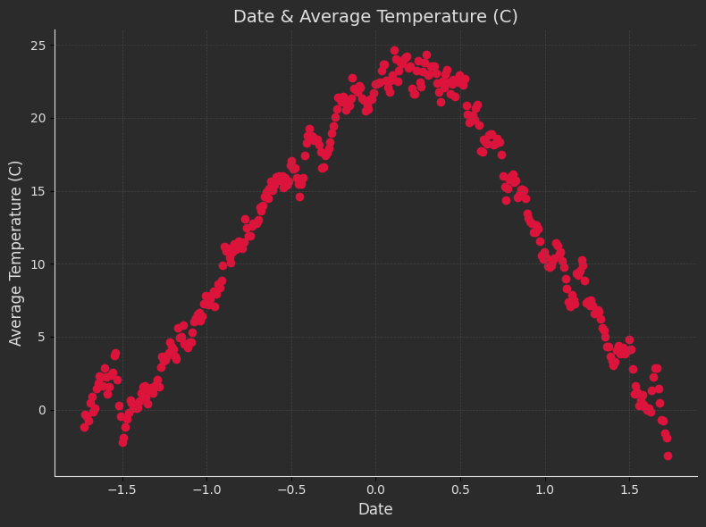
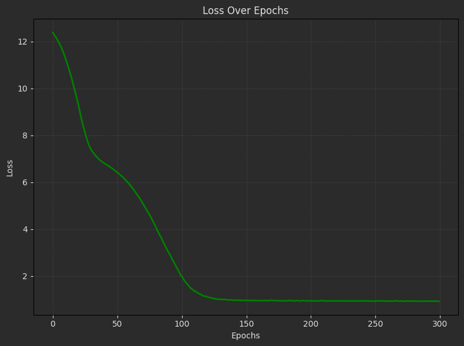
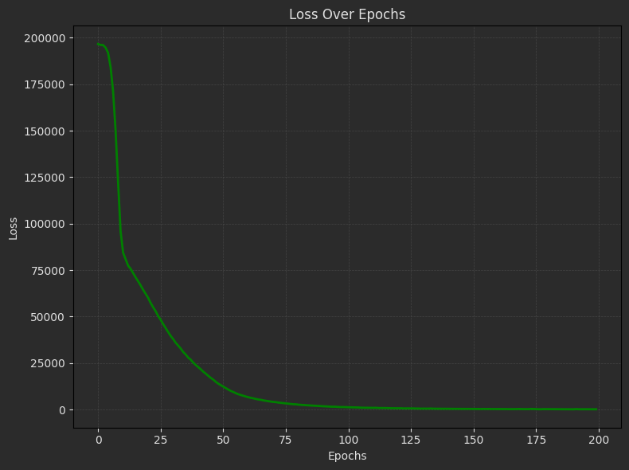

# MLP Using TensorFlow

This repository contains two projects: **Weather Prediction** and **House Price Prediction**. Each project implements machine learning models using neural networks to solve specific tasks. Below is a description of both projects, along with their objectives and instructions.

---
## Projects

### **1. Weather Prediction 🌦**
focusing on predicting weather using neural networks.

- **Data Preprocessing**:
  - Convert dates into "day of the year" format (e.g., Ordibehesht 2 → Day 33, Esfand 29 → Day 365).
  - Compute daily average temperatures from 24 hourly temperature records for each day.

- **MLP Model Training**:
  - Implement a neural network model for weather prediction..
  - Implement the following functions:
    - **evaluate**: Calculate loss for the MLP model.
    - **predict**: Predict daily temperatures based on the "day of the year."
  - Plot the **loss** progression during training.

- **Visualization**:
  - Generate a table of daily average temperatures and their corresponding "day of the year."

    


---

### **2. House Price Prediction**

### Objective:
Build a neural network model to predict house sale prices based on the dataset provided.

### Steps:
1. **Data Preprocessing**:
   - Handle missing values, encode categorical features, and normalize numerical features.

2. **Data Splitting**:
   - Divide the dataset into training (80%) and validation (20%) sets.

3. **Model Implementation**:
   - Create and train a neural network model to predict house sale prices.

4. **Model Evaluation**:
   - Evaluate the model on the validation dataset.


5. **Prediction**:
   - Use the trained model to predict house prices for unseen data.

6. **Model Saving**:
   - Save the trained model with a `.h5` extension using `model.save()`.

---

### **Result:**

#### **1. Weather Prediction**

- Loss Plot:

    


- Evaluated Table:

  | Network | Test Loss | 
  |----------------------|-----------|
  | MLP               | 0.74      |

 


#### **2. House Price Prediction**

- Loss Plot:

  

- Evaluated Table: 

  | Network | Test Loss |
  |-------------|-------------|
  | MLP         | 577         |


---

## How to Run the Code
1. Clone the repository:
   ```sh
   https://github.com/nakhani/Machine-Learning/tree/8a25175abc944c7f0de01b6b493397a9b677a647/MLP_tensorflow2
   ```

2. Navigate to the directory:
   ```sh
   MLP_tensorflow2
   ```

3. Install the required packages:
   ```sh
   pip install -r requirements.txt
   ```

4. Run the assignments:

   ```sh
    jupyter notebook house_price.ipynb # For predict house price with MLP 
    jupyter notebook weather.ipynb # For predict the temperature in a day  with MLP 
   ```

## Dependencies
- Python (TensorFlow, Pandas, NumPy, Matplotlib, Scikit-learn)
- Jupyter Notebook
