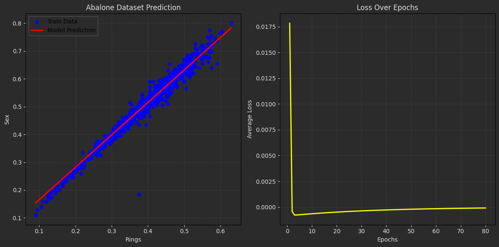
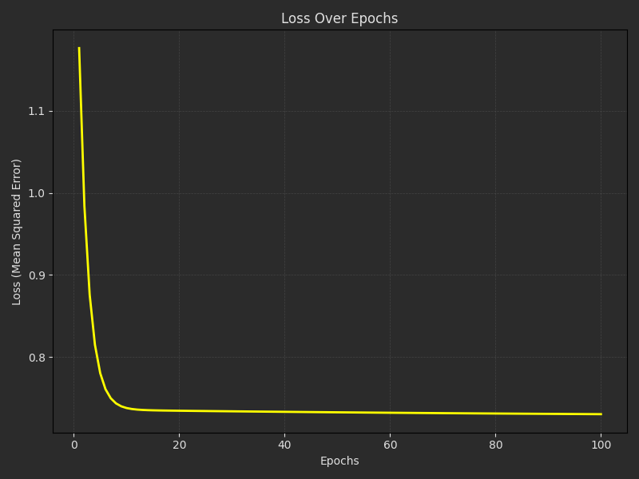

# Perceptron (Perception Neuron)

The perceptron is a supervised learning algorithm typically used for binary classification but adapted here for solving regression problems. The model iteratively updates weights and biases based on training data to minimize the loss function.This repository implements the **Perceptron algorithm** for solving regression problems on various datasets, including:
- **Employee's salary dataset** 💵
- **Abalone dataset** 🐚
- **Boston house-prices dataset** 🏠

The implementation includes:
- Generating simulated datasets using the `scikit-learn` library.
- Splitting data into training and testing sets.
- Creating a custom Perceptron class.
- Training the model and plotting the results (data graph and loss graph).

## Features

- **Simulated Dataset Generation:** 
  - Create linear regression datasets using `make_regression` from `scikit-learn`.
  - Split datasets into training and testing sets.

- **Custom Perceptron Implementation** 

- **Hyperparameter Tuning:**
  - Adjust learning rate, epochs, and other parameters for best results.

- **Data Visualization:** 
  - Plot data and loss graphs as subplots in a single window.
  - For Boston dataset regression, visualize results with 3D plots, including predictions drawn as a plane animation.

## Datasets

### 1. Employee's Salary 💵
- Generate a simulated dataset using the following code:
  ```python
  from sklearn.datasets import make_regression
  ```
- Train and evaluate the perceptron algorithm.
- Plot data graph and loss graph for insights.

### 2. Abalone 🐚
- Fit the perceptron algorithm on the abalone dataset.
- Adjust hyperparameters to optimize results.
- Visualize data graph and loss graph.

### 3. California House Prices 🏠
- Load the dataset using `scikit-learn`
- Choose 2 features (MedInc and AveRooms) as input X and price as target Y.
- Split the dataset into training and testing sets.
- Train and evaluate the perceptron algorithm.
- Display predictions as a 3D plot with animated visualization of the regression plane.

---

### **Result:**

#### **1.Employee's Salary 💵**

  

#### **2.Abalone 🐚**

  

#### **3.Boston House Prices 🏠**

- Loss Plot:

  

- 3D Prediction Animation:


---

## How to Run the Code
1. Clone the repository:
   ```sh
   https://github.com/nakhani/Machine-Learning-/tree/2a68cda1f22446815826f600810fbf25fed49300/LLS_2
   ```

2. Navigate to the directory:
   ```sh
   perceptron
   ```

3. Install the required packages:
   ```sh
   pip install -r requirements.txt
   ```

4. Run the assignments:

   ```sh
    jupyter notebook california_house.ipynb # For predict house prices in California with perceptron 
    jupyter notebook albone.ipynb # For predict length of Albone  with perceptron 
    jupyter notebook employers.ipynb # For predict salary of employers  with perceptron 
   ```

## Dependencies
- Python (Pandas, NumPy, Matplotlib, SciPy, Scikit-learn)
- Jupyter Notebook
- Performance Metrics (Generated using Scikit-learn)