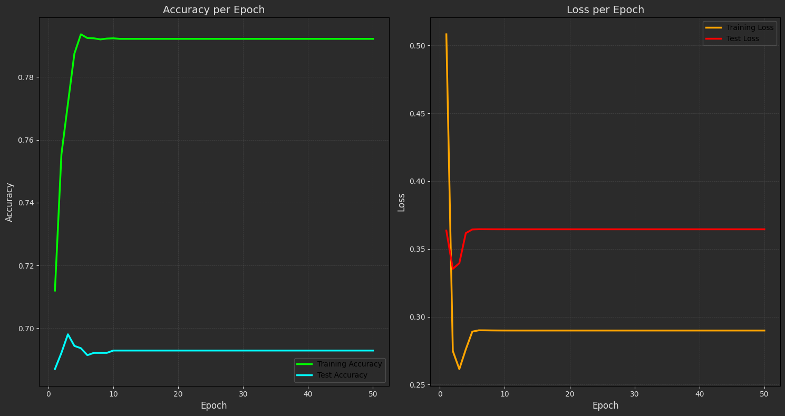
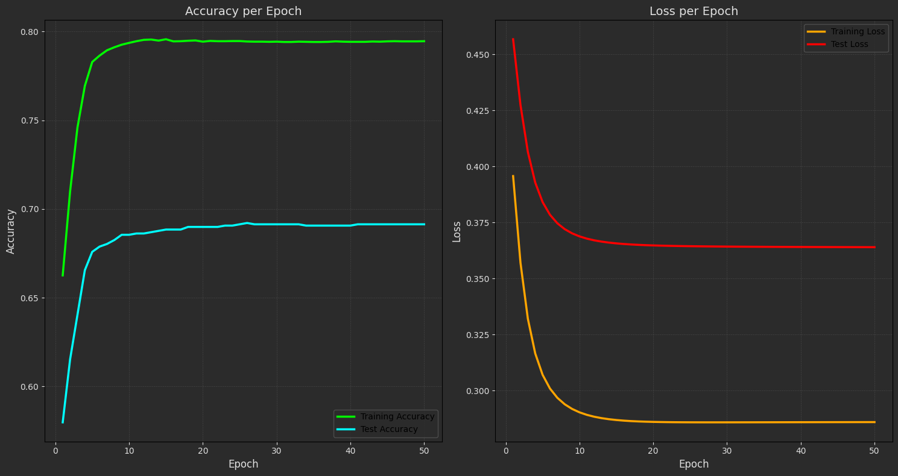
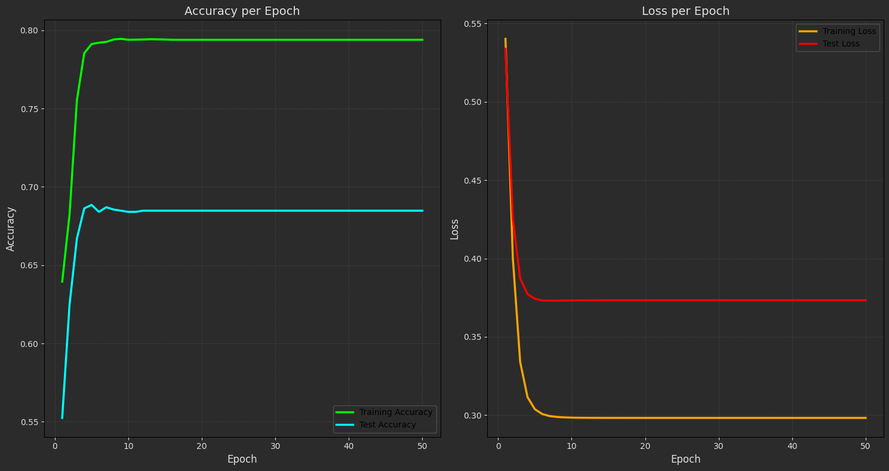
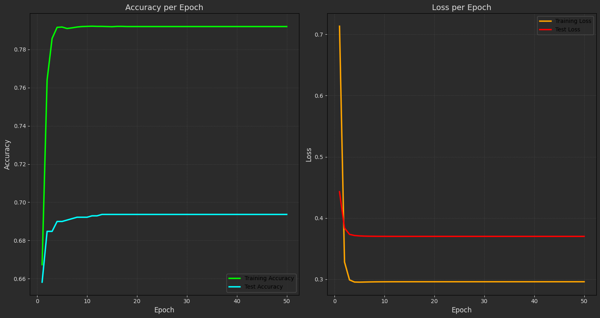
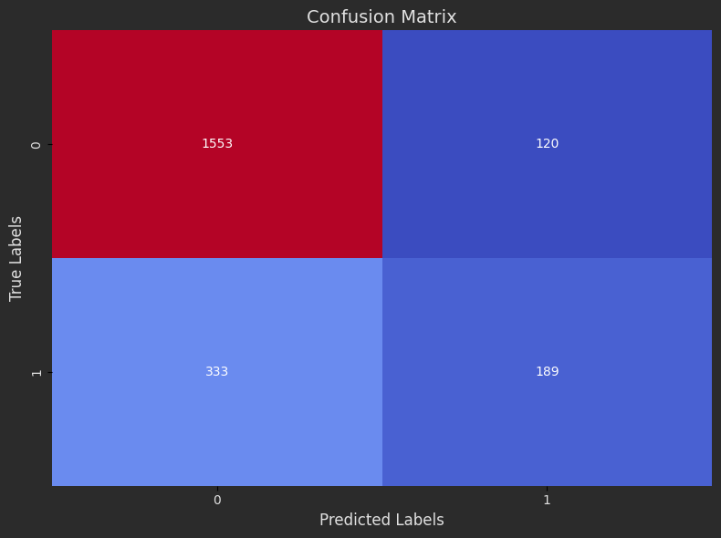
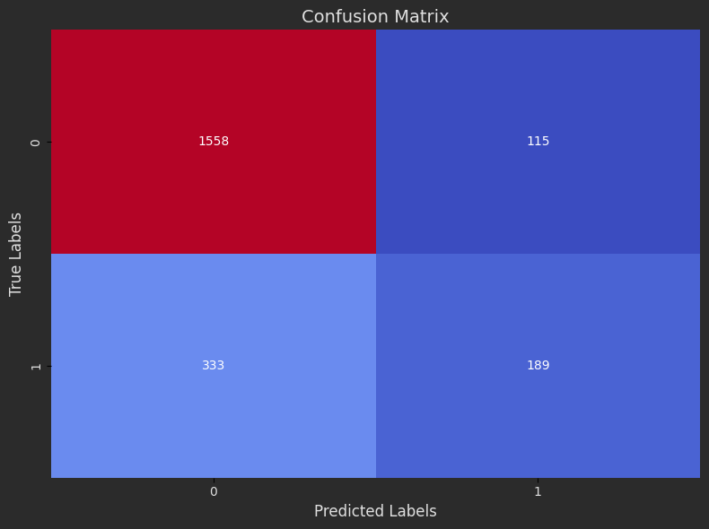
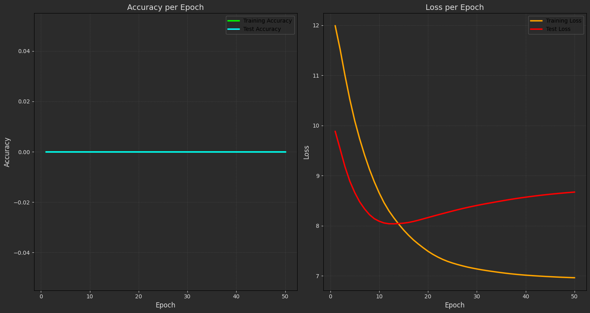

# Perceptron (Perception Neuron)

This repository showcases the **Perceptron Algorithm** applied to both classification and regression tasks. The perceptron is implemented as an object-oriented algorithm and is used to explore linear models in various datasets, including binary classification and weather prediction problems.

---
## Projects

### **1. Surgical Dataset 🏨**
A binary classification task using the perceptron algorithm. 

- **Key Steps**:
  - Train an object-oriented perceptron on the surgical dataset for binary classification.
  - Plot the **accuracy** and **loss** for both training and testing data at each epoch.
  - Calculate and visualize the confusion matrix.
  - Experiment with 5 different activation functions: `sigmoid`, `tanh`, `relu`, `linear`.

---
### **2. Weather Prediction 🌦**
A unique regression problem focused on hourly weather data collected over multiple years.

- **Data Preprocessing**:
  - Convert dates into "day of the year" format (e.g., Ordibehesht 2 → Day 33, Esfand 29 → Day 365).
  - Compute daily average temperatures from 24 hourly temperature records for each day.

- **Linear Model Training**:
  - Train a linear perceptron model on the weather dataset.
  - Implement the following functions:
    - **evaluate**: Calculate loss and accuracy for the perceptron model.
    - **predict**: Predict daily temperatures based on the "day of the year."
  - Plot the **loss** and **accuracy** progression during training.

- **Visualization**:
  - Generate a table of daily average temperatures and their corresponding "day of the year."

    

  - Visualize the data and model predictions on a chart.

- **Stored Results**:
  - Save trained weights (`weights.npy`) and biases (`bias.npy`) to files for future use.

- **Limitations**:
  - Although the data is non-linear, a linear perceptron is intentionally used to create a baseline. Future comparisons will be made with non-linear models.

---


## Features

### **Custom Perceptron Implementation**
- Object-oriented structure for modularity and flexibility.
- Support for multiple activation functions (`sigmoid`, `tanh`, `relu`, `linear`).

### **Data Visualization**
- Plots for loss and accuracy at each epoch for both training and testing phases.
- Confusion matrix visualization for classification tasks.
- Scatterplots for regression predictions and data.

### **Data Preprocessing**
- Efficient handling of time-based weather data.
- Transformation of dates into "day of the year" format.
- Computation of daily averages from hourly temperature records.

### **Model Training**
- Hyperparameter tuning: Learn and adjust learning rates, epochs, and activation functions.
- Save model weights and biases for reproducibility (`weights.npy`, `bias.npy`).

---

### **Result:**

#### **1.Surgical Dataset 🏨**

- Loss and Accuracy Plots:

 - Relu:

    

 - Sigmiod:
    
    

 - Tanh:
   
    

 - Linear:
   
    


- Confusion Matrix:

 - Relu:

    

 - Sigmiod:
    
    

 - Tanh:
   
    

 - Linear:
   
    

  

- Evaluated Table:

  | Activation Functions | Test Loss | Test Accuracy|
  |----------------------|-----------|--------------|
  | Relu                 | 0.37      | 0.68         |
  | Sigmoid              | 0.37      | 0.68         |
  | Tanh                 | 0.38      | 0.68         |
  | Linear               | 0.37      | 0.68         |
 


#### **2.Weather Prediction 🌦**

- Loss and Accuracy Plots:

  

- Evaluated Table: 

  | Test Loss | Test Accuracy |
  |-------------|-------------|
  | 7.2         | 0.0         |


---

## How to Run the Code
1. Clone the repository:
   ```sh
   https://github.com/nakhani/Machine-Learning/tree/9a6611e906c0557c1519d4bf05d81ed3a4a0aa0d/Perceptron_2
   ```

2. Navigate to the directory:
   ```sh
   Perceptron_2
   ```

3. Install the required packages:
   ```sh
   pip install -r requirements.txt
   ```

4. Run the assignments:

   ```sh
    jupyter notebook surgical.ipynb # For predict wether a person has a disorder sign with perceptron 
    jupyter notebook weather.ipynb # For predict the temperature in a day  with perceptron 
   ```

## Dependencies
- Python (Pandas, NumPy, Matplotlib, Scikit-learn)
- Jupyter Notebook
