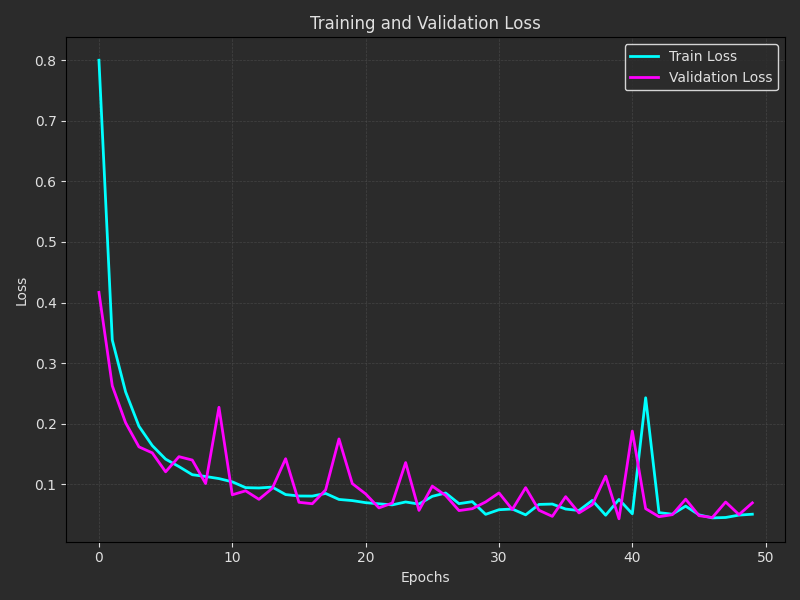
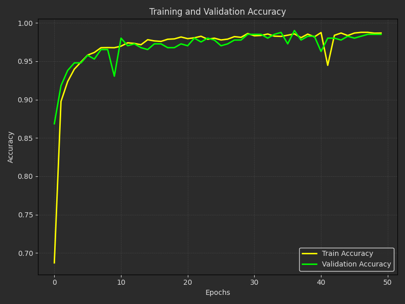

# MiniProject: Snake Game with Machine Learning 🐍🍎

In this mini-project, we create a machine learning-based Snake Game that uses a neural network to predict movements, aiming to optimize gameplay performance. The trained model learns from gameplay data stored in `dataset.csv` and enables autonomous snake movements during inference.
  


---

My program has below **features**:

- If snake eats spider, you earn 1 point
- If snake eats frog, you earn 2 points
- If snake eats shit, you lose 1 point
- If snake collides with each wall, it is **GAME OVER**
- If snake collides with his body, it is **GAME OVER**
- If score reaches to 0, it is **GAME OVER** 
- In AI version, snake moves automatic and eats food

---

## File Descriptions
- **dataset.py**: Captures gameplay data where Snake moves automatically using predefined rules (`if`, `else`, `for`, `while`, etc.). Outputs a dataset (`dataset.csv`) with features (`X`) and labels (`Y`).
  
  **Features (`X`)**:
  - **Direction indicators**:
    - `S0`, `S1` – The location of the snake
    - `A0`, `A1` – The location of the apple

    For example:
    - `S0=133`: Location on the x-axis of the snake
    - `A1=350`: Location on the y-axis of the apple


  **Labels (`Y`)**:
  - Movement direction: `u` (up)(1), `r` (right), `d` (down)(0)(3), `l` (left)(2).

- **train_model.py**: Trains a neural network for movement classification using the data in `dataset.csv`.

- **main_ML.py**: Uses the trained model's weights to autonomously control the snake in the game environment.

---

## Implementation Steps
1. **Dataset Collection**:
   - The gameplay data (`dataset.csv`) is collected using `main.AI.py`.
   - Feature values are calculated dynamically during Snake's movement.

2. **Training Neural Network**:
   - The model is trained on the collected dataset using `train_model.py`.
   - Key metrics such as accuracy and loss are tracked during training.

3. **Autonomous Gameplay**:
   - The trained neural network is deployed in `main_ML.py`, allowing the snake to move automatically and make decisions.

---

## Results and Metrics
- Train and Validation Loss Plot:

  

- Train and Validation Accuracy Plot:

  

- Evaluated Table: 

  | Test Loss  | Test Accuracy |
  |-------------|-------------|
  | 0.04        | 0.98       |


---
## How to Run the Code
1. Clone the repository:
   ```sh
   https://github.com/nakhani/Machine-Learning/tree/8a25175abc944c7f0de01b6b493397a9b677a647/MLP_tensorflow2
   ```

2. Navigate to the directory:
   ```sh
   miniproject_snake
   ```

3. Install the required packages:
   ```sh
   pip install -r requirements.txt
   ```

4. Run the project:

   ```sh
    python main_ML.py # For running AI snake with Machine Learning
    python main_AI.py # For generating train dataset 
    python train_model.py # For training ML network
   ```

## Dependencies
- Python (TensorFlow, Pandas, NumPy, Matplotlib, Scikit-learn, Arcade)


